## 전자정부 프레임워크 개발환경 셋팅하기. 

- 2 다운로드파일실행
  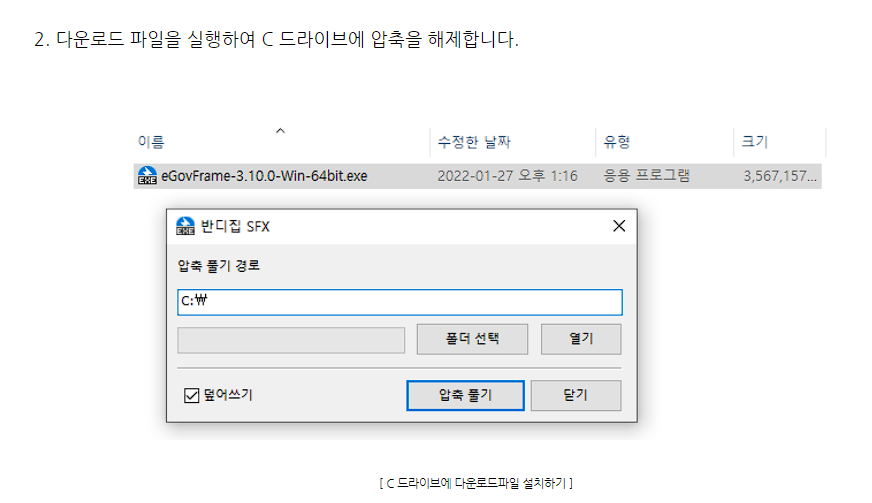

- 3 workspace폴더생성
  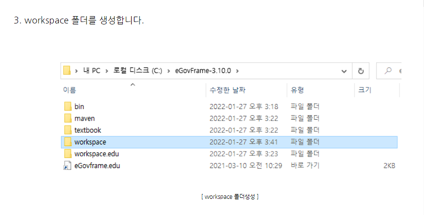

- 4 bin_eclipse_eclipse.exe실행시workspace경로변경
  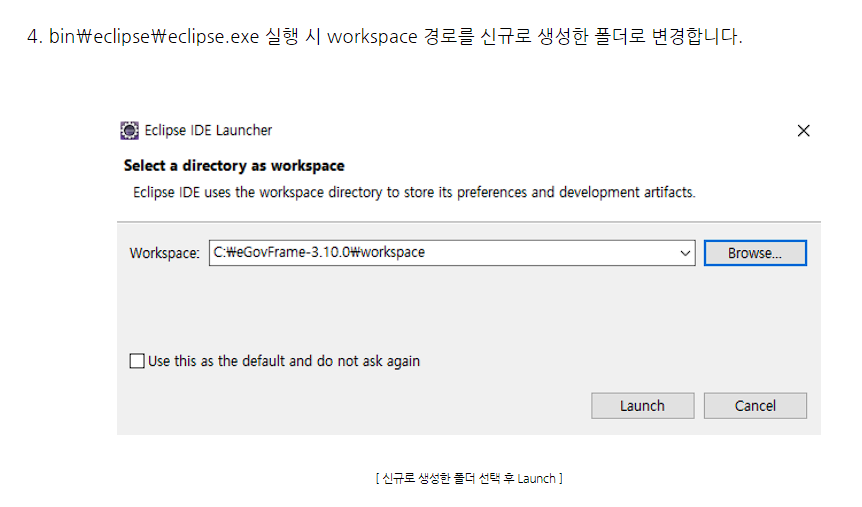

- 5-1 eGovFrameWebProject 로 신규생성_file_new_other실행하기
  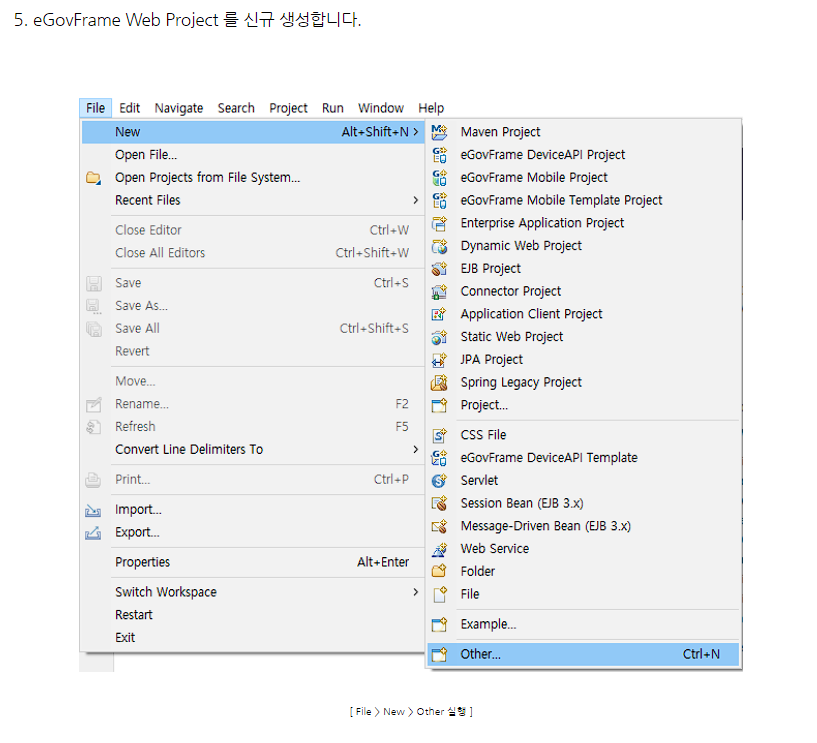

- 5-2 eGovFrame_eGovFrame Web Project 선택후 Next
  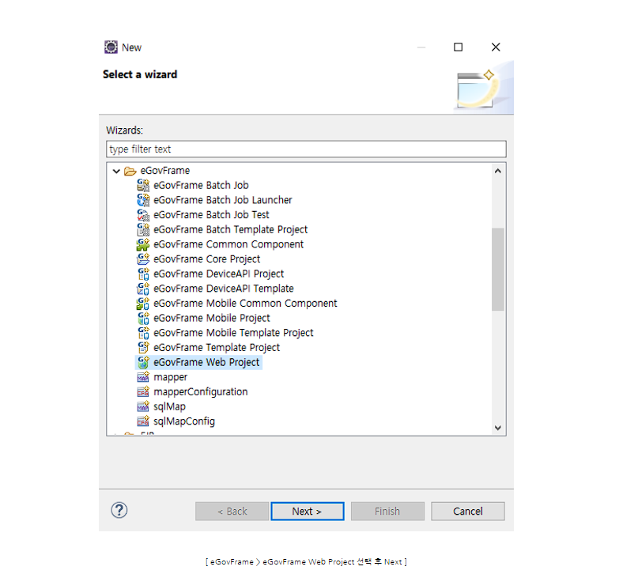

- 5-3 project 정보입력 후 Next
  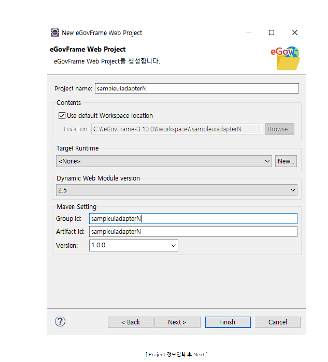

- 5-4 예제샘플을 위한 Generate Example 체크 후 Finish
  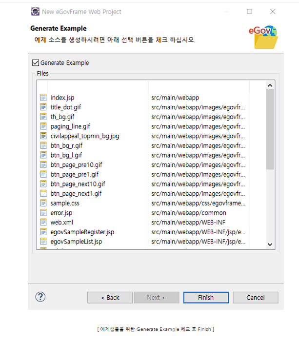

- 5-5 해당 창이 나오면 Open Perspective선택 (상단메뉴에 eGovFrame관련메뉴가추가됨)
  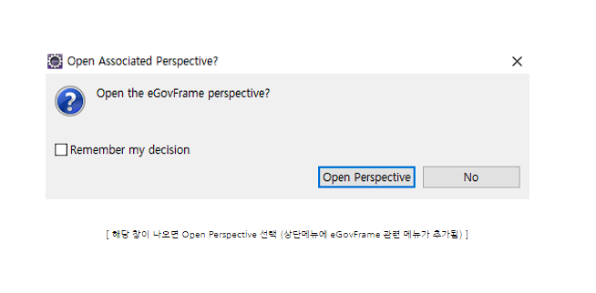

- 6 maven의 settings.xml경로를 셋팅
  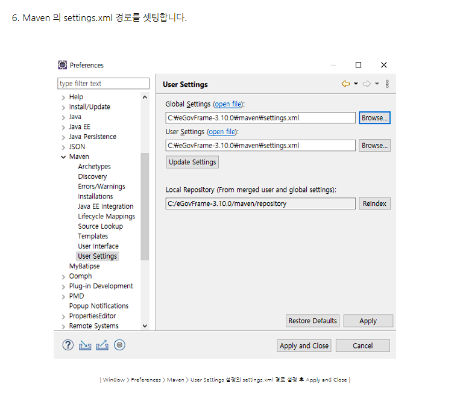

- 7-1 Window_Preferences_Server_Runtime Environments_Add 선택
  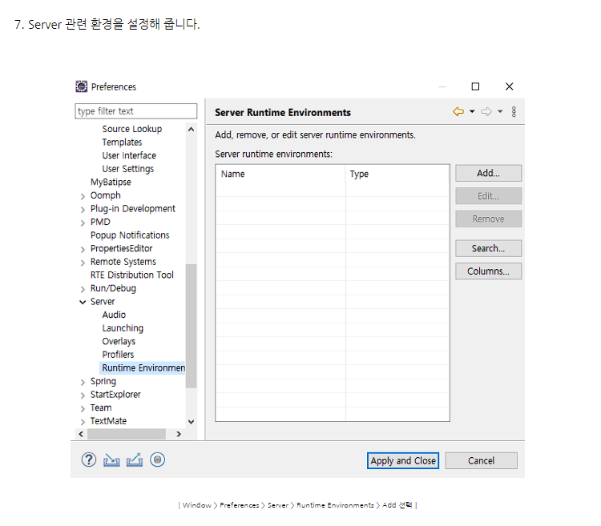

- 7-2 Apache_Apache Tomcat v8.5 선택 후 Next
  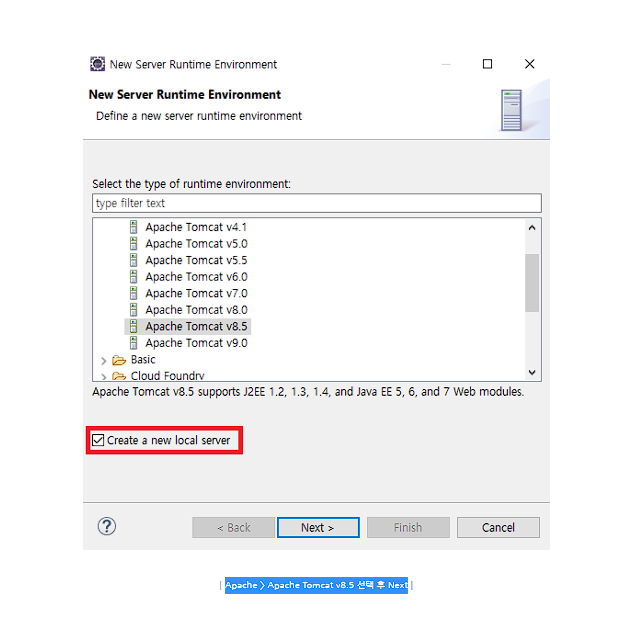

- 7-3 Tomcat installation directory 선택 후 Finish
  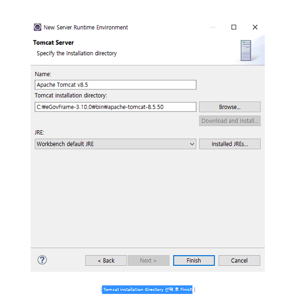

- 8-1 Server에 신규생성한 Web Project Context 를 추가
  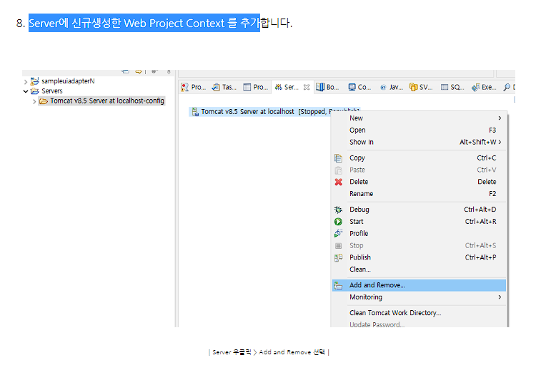

- 8-2 좌측 sampleuiadapterN 프로젝트를 우측으로 Add 후 Finish
  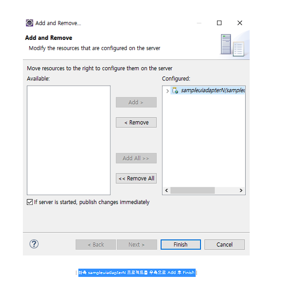

- 9 Server Start 실행 후 정상구동 확인 후 웹브라우져에 실행
  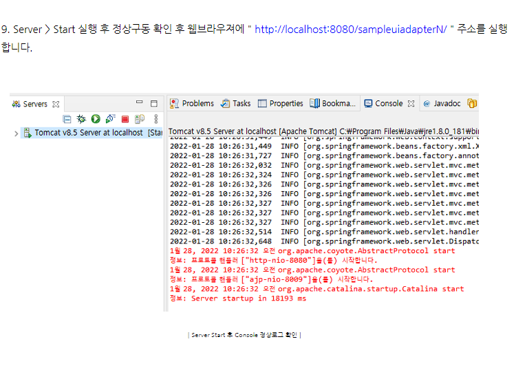